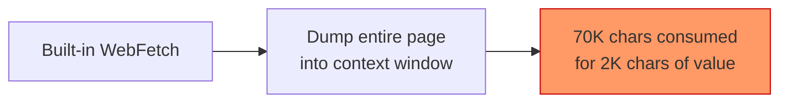
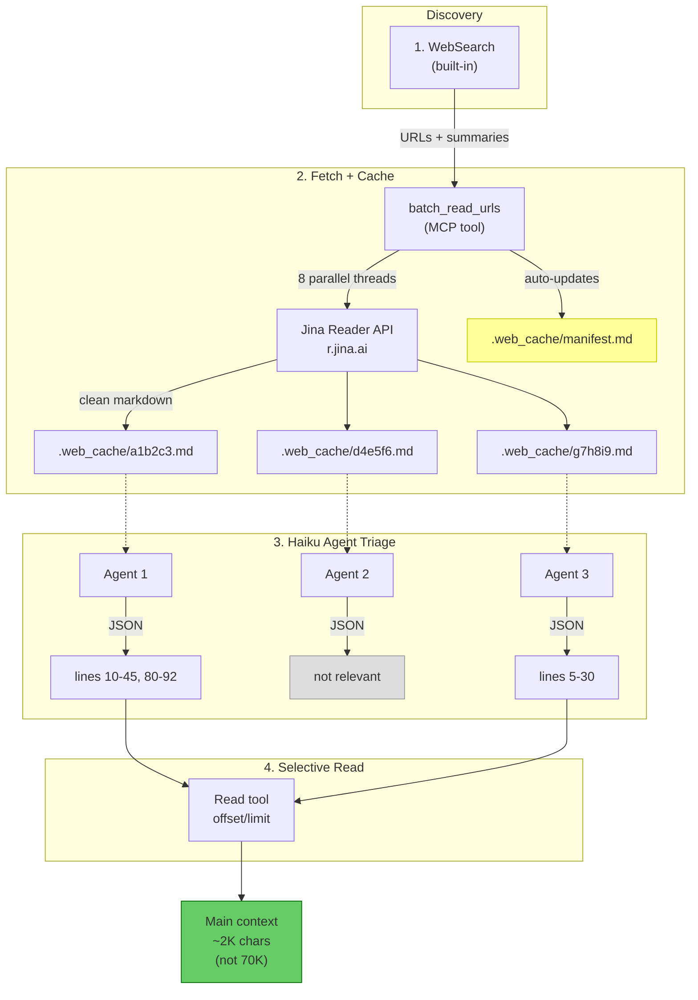
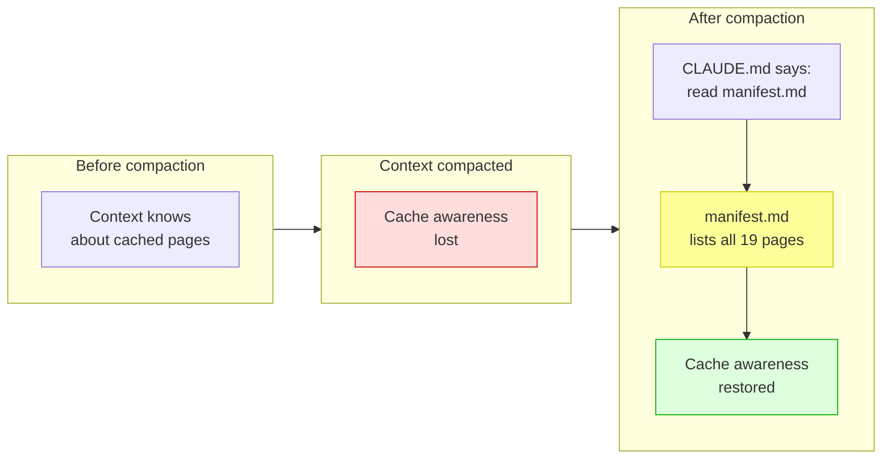
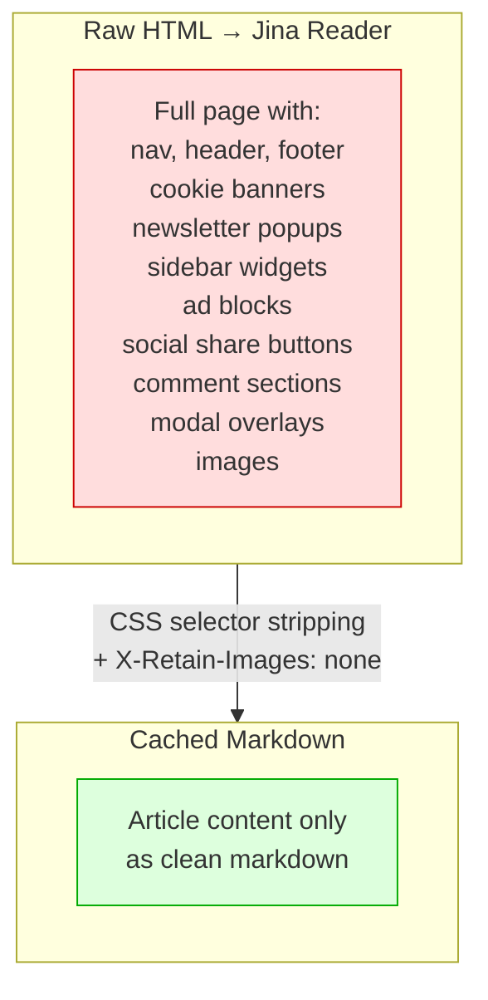
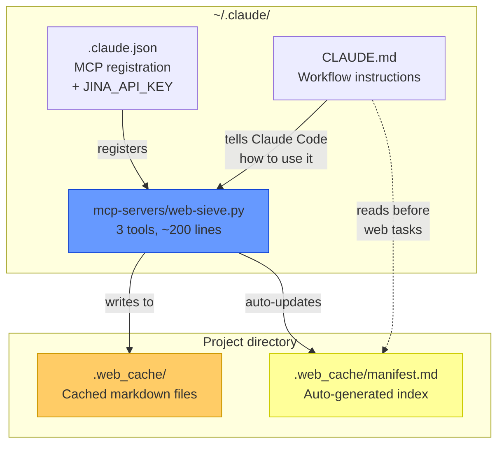

# web-sieve — Claude Code Web Pipeline

A custom web research pipeline that replaces Claude Code's built-in `WebFetch` with clean markdown extraction, project-level caching, and AI-powered triage — keeping full-resolution web content available while consuming minimal context window.

## The Problem



Claude Code's built-in web tools either dump entire pages into the conversation (wasteful — a typical page is 20-70K chars) or return lossy summaries (insufficient for detailed work). Neither approach scales when you need to research across multiple pages.

## The Solution



## Step-by-Step

### 1. Discover — `WebSearch`

Claude Code's built-in web search returns concise summaries and source URLs. Good for discovery, bad for extraction.

### 2. Fetch + Cache — `batch_read_urls`

A single MCP tool call fetches all discovered URLs in parallel through [Jina Reader](https://r.jina.ai). Each page is:

- Rendered through Jina's headless browser
- Converted to clean markdown
- Stripped of junk (nav, cookies, ads, sidebars, modals — 30+ CSS selectors)
- Images removed (markdown-only)
- Cached permanently to `{project}/.web_cache/{hash}.md`

The tool returns **metadata only** — never the content:

```json
[
  {"path": "/project/.web_cache/a1b2c3.md", "title": "Page Title", "lines": 340, "chars": 18200, "cached": false},
  {"path": "/project/.web_cache/d4e5f6.md", "title": "Another Page", "lines": 520, "chars": 31000, "cached": true}
]
```

After every fetch, a **`manifest.md`** is auto-generated in the cache directory — a markdown table listing all cached pages with title, URL, file, and date.

### 3. Triage — Parallel Haiku Agents

Cheap, fast AI agents (one per cached page) scan the full content and return structured JSON identifying exactly which line ranges are relevant to the query:

```json
{"relevant": true, "ranges": [[10, 45], [80, 92]]}
```
```json
{"relevant": false}
```

Agents run in parallel — triage takes ~3-5s regardless of page count.

### 4. Inject — `Read` with offset/limit

Only the relevant line ranges enter the main conversation. Everything else stays on disk, available for later queries.

## Surviving Context Compaction



When Claude Code compacts the conversation, it loses awareness of cached pages. The manifest solves this:

1. **`manifest.md`** is auto-rebuilt on every fetch — lists all cached pages in a markdown table
2. **`CLAUDE.md`** instructs Claude to read `manifest.md` before any web task
3. After compaction, Claude reads the manifest and knows exactly what's cached — no re-fetching

## What Gets Stripped



30+ CSS selectors strip common junk patterns before caching:

| Category | Selectors |
|---|---|
| Navigation | `nav`, `header`, `footer`, `[role='banner']`, `[role='navigation']` |
| Consent | `[class*='cookie']`, `[class*='consent']`, `[id*='cookie']` |
| Popups | `[class*='popup']`, `[class*='modal']`, `[class*='overlay']` |
| Marketing | `[class*='newsletter']`, `[class*='subscribe']`, `[class*='signup']` |
| Ads/Promos | `[class*='advert']`, `[class*='sponsor']`, `[class*='promo']` |
| Social | `[class*='share']`, `[class*='social']`, `[class*='comment']` |
| Layout junk | `[class*='sidebar']`, `[class*='widget']`, `[class*='related-post']` |

## Cache Format

Files stored as `.web_cache/{sha256[:12]}.md` with YAML frontmatter:

```yaml
---
url: https://example.com/article
title: How to Build a Web Pipeline
fetched: 2026-02-15T10:30:00+00:00
hash: a1b2c3d4e5f6
---
Title: How to Build a Web Pipeline
URL Source: https://example.com/article
Markdown Content:
[... clean article content ...]
```

A `manifest.md` is auto-maintained alongside the cached files:

```markdown
# Web Cache Manifest

| # | Title | URL | File | Fetched |
|---|---|---|---|---|
| 1 | How to Build a Pipeline | https://example.com/article | a1b2c3d4e5f6.md | 2026-02-15 |
| 2 | Another Article | https://example.com/other | f6e5d4c3b2a1.md | 2026-02-16 |

**Total: 2 pages cached.**
```

Cache is **permanent and project-scoped** — pages persist across sessions. The manifest ensures Claude always knows what's available, even after context compaction.

## Performance

```mermaid
xychart-beta
    title "Context Window Compression"
    x-axis ["Narrow query (2 pages)", "Comparison (3 pages)", "Broad research (5 pages)"]
    y-axis "Characters" 0 --> 90000
    bar [23700, 28800, 83100]
    bar [1200, 8500, 10500]
```



| Scenario | Pages | Cached | Actually Used | Compression | Triage Time |
|---|---|---|---|---|---|
| Narrow single-page query | 2 | 24K chars | 1.2K chars | **95%** | ~4s |
| Multi-page comparison | 3 | 29K chars | 8.5K chars | **70%** | ~3s |
| Broad 5-page research | 5 | 83K chars | 10.5K chars | **87%** | ~5s |

Compression scales with irrelevance — narrow queries save more. Triage latency is flat because agents run in parallel.

## Architecture

Three files. That's it.



| File | Role |
|---|---|
| `~/.claude/mcp-servers/web-sieve.py` | The MCP server. 3 tools (`read_url`, `batch_read_urls`, `list_cache`), CSS stripping, Jina API integration, caching, manifest generation. Single self-contained Python script — runs via `uv run --script` with inline PEP 723 deps. |
| `~/.claude.json` | Registers the server globally under `mcpServers.web-sieve` with the `JINA_API_KEY` env var. |
| `~/.claude/CLAUDE.md` | Instructions that tell Claude Code to always use this 5-step workflow for any web task, and to read `manifest.md` before starting. |

## Setup

1. **Get a Jina API key** from [jina.ai](https://jina.ai)
2. **Drop the server script** at `~/.claude/mcp-servers/web-sieve.py`
3. **Register it** in Claude Code:
   ```bash
   claude mcp add -s user -e "JINA_API_KEY=your_key_here" -- web-sieve \
     uv run --script ~/.claude/mcp-servers/web-sieve.py
   ```
4. **Add workflow instructions** to `~/.claude/CLAUDE.md`
5. **Restart Claude Code** to pick up the new MCP server

## Known Limitations

- **Cloudflare-protected sites** (Medium, Hacker News) may return challenge pages (~500 chars). Skip these.
- **Nav-heavy sites** (The New Stack) still have junk despite CSS stripping — content may be buried deep.
- **MCP server restarts** are required after editing `web-sieve.py` — restart Claude Code to apply changes.
- **`cache_dir` must be absolute** — the MCP server's working directory may not match the project directory.
